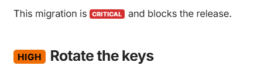
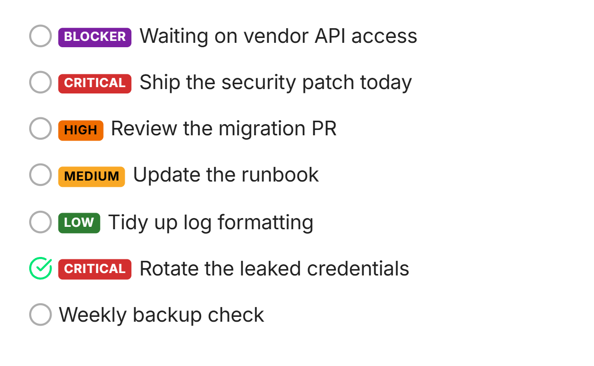

# markdown-priority-badges

[](https://github.com/antoinekh/markdown-priority-badges/actions/workflows/ci.yml)
[](https://pypi.org/project/markdown-priority-badges/)
[](https://pypi.org/project/markdown-priority-badges/)
[](LICENSE)

A Python-Markdown extension that renders **priority badges** two ways: `!level` keywords inline anywhere, and a `!` / `!!` shorthand on task-list items. Works in Zensical, MkDocs, or plain Python-Markdown. The badge ships its own inline styles, so no external CSS is required.

## Why?

This is not a replacement for admonitions / callouts (`!!! warning`, `> [!NOTE]`). Those wrap a block of explanatory text. Priority badges are the opposite: tiny inline pills you can drop anywhere, but that fit especially nicely into a **list item, todo, or table cell**, so priority is scannable at a glance without turning the line into a block. The intended usage is exactly that split: reach for a callout when you have a paragraph to say, and reach for a badge to mark some rows.

## Inline keywords

Inline `!level` keywords (`!low` / `!medium` / `!high` / `!critical`) work anywhere (prose, headings, table cells):

```markdown
This migration is !critical and blocks the release.

## !high Rotate the keys
```



Only the configured level keywords match, so an ordinary `!`, `!important`, or `!highest` in text is never touched.

## Todo shorthand

Inside a checkbox item, `!` = high and `!!` = critical, a quick shorthand for `!high` / `!critical`. The explicit `!level` keywords (including custom ones like `!todo`) work in list items too, so a todo list can mix all of them:

```markdown
- [ ] !blocker Waiting on vendor API access
- [ ] !! Ship the security patch today
- [ ] ! Review the migration PR
- [ ] !medium Update the runbook
- [ ] !low Tidy up log formatting
- [x] !! Rotate the leaked credentials
- [ ] Weekly backup check
```



The shorthand marker must come first (right after the checkbox) and be followed by a space, so `- [ ] !important note` is left untouched. Works with `-`, `*`, `+` bullets and both `[ ]` / `[x]` states.

## Levels

Four built-in levels, plus any custom level you add via config (`blocker` below is an example):

| Level    | Origin         | Keyword     | Renders as                                            |
| -------- | -------------- | ----------- | ----------------------------------------------------- |
| Low      | built-in       | `!low`      |            |
| Medium   | built-in       | `!medium`   |      |
| High     | built-in       | `!high`     |          |
| Critical | built-in       | `!critical` |  |
| Blocker  | example custom | `!blocker`  |    |
| Todo     | example custom | `!todo`     |          |

The default backgrounds are low green, medium amber, high orange, critical red. The `!` / `!!` task-list shorthand always maps to `high` / `critical`; lower levels are used via their inline keyword (`!low`, `!medium`). Badge text color (black or white) is chosen automatically for legibility against each background.

### Custom / extra levels

The `levels` option is a name → color map that is **merged over** the built-ins, so you can recolor a level or add your own:

```toml
# zensical.toml
[project.markdown_extensions.markdown_priority_badges.levels]
blocker = "#7b1fa2"  # a new purple level, used as !blocker
todo    = "#1565c0"  # a new blue level, used as !todo
low     = "#1b5e20"  # recolor a built-in
```

```python
# plain Python-Markdown
from markdown_priority_badges import PriorityBadgesExtension
markdown.markdown(text, extensions=["pymdownx.tasklist", PriorityBadgesExtension(levels={"blocker": "#7b1fa2"})])
```

Colors may be 3- or 6-digit hex (`#7b1fa2`, `#eee`) or a common CSS name (`red`, `yellow`, `rebeccapurple`); the badge text color auto-contrasts against them.

## Install & enable

```bash
uv add markdown-priority-badges
```

(or `pip install markdown-priority-badges`)

Zensical (`zensical.toml`):

```toml
[project.markdown_extensions.markdown_priority_badges]
```

Plain Python-Markdown:

```python
markdown.markdown(text, extensions=["pymdownx.tasklist", "markdown_priority_badges"])
```

The badge renders as `<span class="task-prio task-prio--<level>" style="...">...</span>`. The `task-prio` classes are kept for optional site-side overriding, but no CSS is needed by default.
